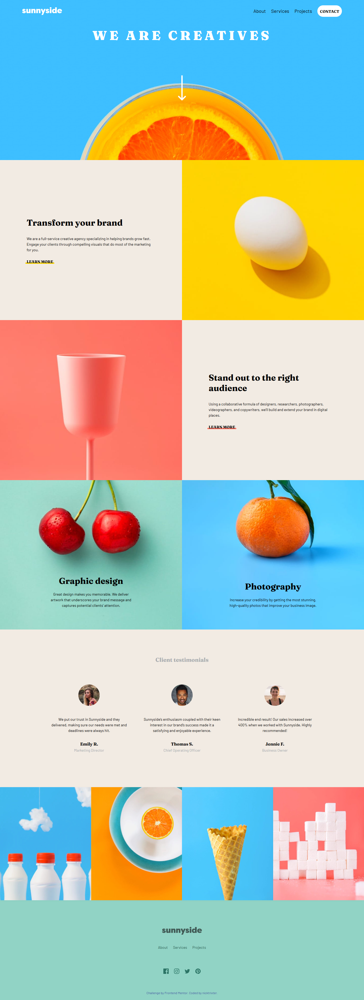
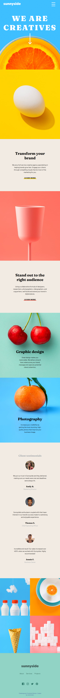

# Frontend Mentor - Sunnyside agency landing page solution

This is a solution to the [Sunnyside agency landing page challenge on Frontend Mentor](https://www.frontendmentor.io/challenges/sunnyside-agency-landing-page-7yVs3B6ef). Frontend Mentor challenges help you improve your coding skills by building realistic projects.

## Table of contents

- [Overview](#overview)
  - [The challenge](#the-challenge)
  - [Screenshot](#screenshot)
  - [Links](#links)
- [My process](#my-process)
  - [Built with](#built-with)
  - [What I learned](#what-i-learned)
  - [Continued development](#continued-development)
  - [Useful resources](#useful-resources)
- [Author](#author)
- [Acknowledgments](#acknowledgments)

## Overview

### The challenge

Users should be able to:

- View the optimal layout for the site depending on their device's screen size
- See hover states for all interactive elements on the page

### Screenshot




### Links

- Solution URL: [https://github.com/nicktrixster/sunnyside-agency-landing-page-main]
- Live Site URL: [https://sunnyside-agency-page-solution.netlify.app/]

## My process

### Built with

1. Front-End Technologies:
- Semantic HTML5 markup
- CSS3 (Extensive styling with modern features)
- Vanilla JavaScript (Minimal usage for mobile menu functionality)
2. Key CSS Features Used:
- Flexbox (For layouts and responsive design)
- CSS Grid (For gallery section)
- Media Queries (For responsive design)
- CSS Variables (HSL color values)
- CSS Transitions (For hover effects)
- Modern CSS selectors and pseudo-elements
3. Responsive Design Features:
- Mobile-first workflow
- Breakpoints at 768px and 375px
- Flexible layouts using relative units
- Responsive images and typography
4. External Resources:
- Google Fonts (Barlow and Fraunces fonts)
- Custom images and SVG icons
- Frontend Mentor challenge assets

### What I learned

"Through this project, I gained practical experience implementing modern CSS layout techniques, specifically mastering the combination of CSS Grid and Flexbox for creating responsive, dynamic layouts. I deepened my understanding of CSS pseudo-elements, particularly the ::after selector, utilizing it for creating interactive underline animations and decorative elements. This included implementing custom hover effects and managing element positioning through absolute and relative positioning techniques. Additionally, I learned to create fluid layouts that gracefully adapt across different viewport sizes while maintaining design integrity and user experience."

Key technical points covered:
- CSS Grid for gallery layouts
- Flexbox for component alignment and responsive containers
- Pseudo-element manipulation for interactive UI elements
- Complex selector patterns
- Responsive design principles
- CSS transitions and animations

```css
proud-of-this-css:
.tranform-col1 a::after,
    .standout-col2 a::after {
      content: '';
      position: absolute;
      left: 95px;
      right: 95px;
      bottom: 1px;
      height: 5px;
      border-radius: 12px;
      z-index: -1;
      transition: height 0.3s ease;
    }
    .tranform-col1 a:hover::after,
    .standout-col2 a:hover::after {
      height: 6px;
    }
    .gallery-section {
      display: grid;
      grid-template-columns: repeat(4, 1fr);
      gap: 0;
    }

    @media screen and (max-width: 768px) {
    .gallery-section {
        grid-template-columns: repeat(1, 1fr);
      }
    }
```
### Continued development

- CSS Grid for gallery layouts
- Flexbox for component alignment and responsive containers

### Useful resources

- [https://poe.com/GPT-4o] - This helped me for debugging.
- [https://www.w3schools.com/css/css3_flexbox.asp] - This is an amazing tutorial which helped me finally understand css flexbox layouts design and debugging. I'd recommend it to anyone still learning this concept.

## Author

- Frontend Mentor - [@nicktrixter](https://www.frontendmentor.io/profile/nicktrixter)

## Acknowledgments

Credit goes to https://www.w3schools.com and GPT-4o which are usefull resources for learning web dev/design technologies.
🎉 Shoutout to my baby girl GG for providing entertainment and motivation during the completion of this project.
